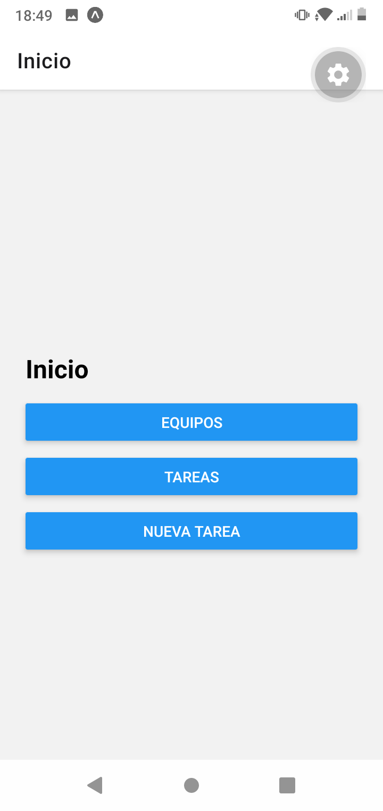
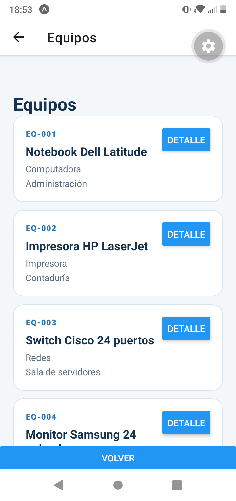
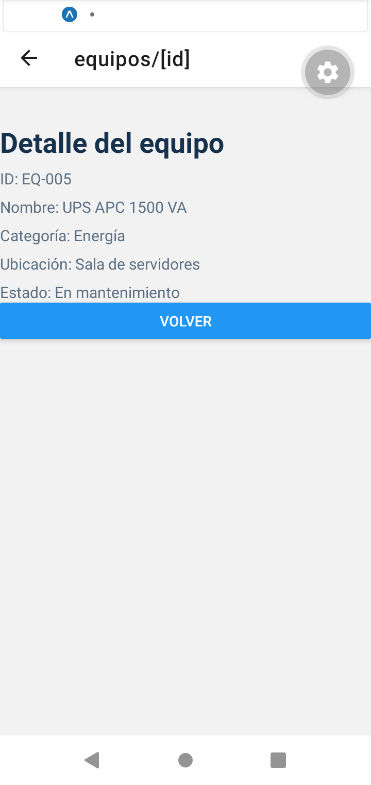
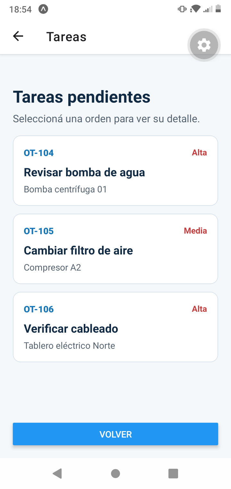
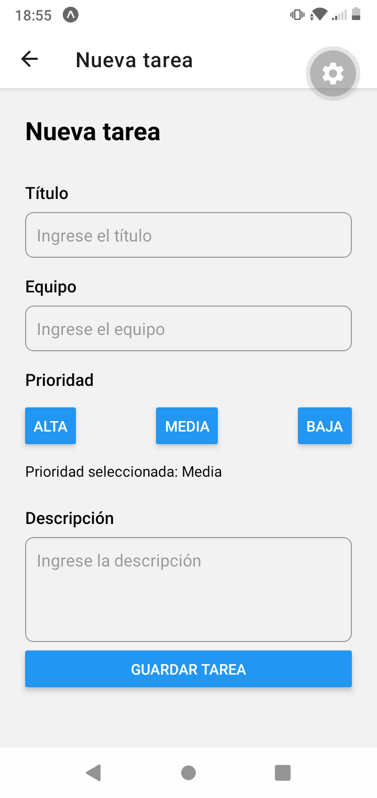

# Aplicación navegable

Aplicación móvil desarrollada con **React Native y Expo**.

El proyecto permite navegar entre diferentes pantallas relacionadas con la gestión de equipos y tareas de mantenimiento.

## Funcionalidades

La aplicación cuenta con las siguientes funcionalidades:

* Pantalla de inicio con acceso a las diferentes opciones.
* Listado de equipos.
* Visualización del detalle de cada equipo.
* Listado de tareas.
* Visualización del detalle de cada tarea.
* Creación de nuevas tareas.
* Navegación entre las diferentes pantallas mediante **Expo Router**.
* Uso de rutas dinámicas para mostrar el detalle de equipos y tareas.

## Tecnologías utilizadas

* React Native
* Expo
* Expo Router
* TypeScript
* JavaScript/TypeScript
* React Native Safe Area Context

## Estructura del proyecto

```text
app/
├── _layout.tsx
├── index.tsx
├── equipos.tsx
├── nueva-tarea.tsx
├── tareas.tsx
├── equipos/
│   └── [id].tsx
└── tareas/
    └── [id].tsx

components/
├── TarjetaEquipo.styles.ts
├── TarjetaEquipots
└── TaskCard.tsx

data/
├── equipos.ts
└── tasks.ts

styles/
├── colors.ts
└── listas.styles.ts

types/
├── Equipo.ts
└── task.ts

La carpeta `app` contiene las pantallas y rutas de la aplicación.

La carpeta `components` contiene componentes reutilizables utilizados para mostrar los equipos y las tareas.

La carpeta `data` contiene los datos utilizados por la aplicación.

La carpeta `types` contiene los tipos utilizados para definir la estructura de las tareas.

## Instalación

Para ejecutar el proyecto es necesario tener instalado:

* Node.js
* Expo
* Expo Go en un dispositivo móvil, si se desea probar desde el teléfono.

Primero clonar el repositorio:

```bash
git clone https://github.com/natanael1289/navegacionddm.git
```

Ingresar a la carpeta del proyecto:

```bash
cd navegacionddm
```

Instalar las dependencias:

```bash
npm install
```

Iniciar el proyecto:

```bash
npx expo start
```

Luego se puede ejecutar la aplicación utilizando Expo Go o un emulador compatible.

## Navegación

La aplicación utiliza **Expo Router** para manejar la navegación.

Desde la pantalla de inicio se puede acceder a:

* **Equipos:** muestra el listado de equipos disponibles.
* **Tareas:** muestra el listado de tareas.
* **Nueva tarea:** permite ingresar una nueva tarea.

Los equipos y tareas utilizan rutas dinámicas para acceder a sus respectivos detalles.

Por ejemplo:

```text
/equipos/1
/tareas/OT-104
```

## Creación de tareas

Desde la opción **Nueva tarea** se pueden ingresar:

* Título.
* Equipo.
* Prioridad.
* Descripción.

Al guardar una tarea, esta se agrega al listado y puede visualizarse desde la pantalla **Tareas**.

## Capturas de pantalla

### Pantalla de inicio



### Listado de equipos



### Detalle de equipo



### Listado de tareas



### Nueva tarea



## Commits

El desarrollo del proyecto se realizó mediante commits progresivos para mostrar el avance de la aplicación.

Algunos de los cambios realizados fueron:

1. Initial commit.
2. Creación de estructura.
3. Listas creadas de equipos y tareas con .router.
4. Detalle agregado.
5. Agregado estilo de detalle equipo.
6. Formulario de nueva tarea y Readme agregado.
7. Capturas agregadas.

## Repositorio

El código fuente del proyecto se encuentra disponible en:

https://github.com/natanael1289/navegacionddm
